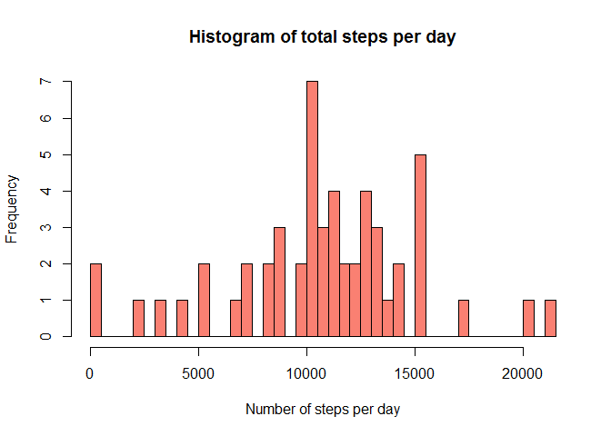
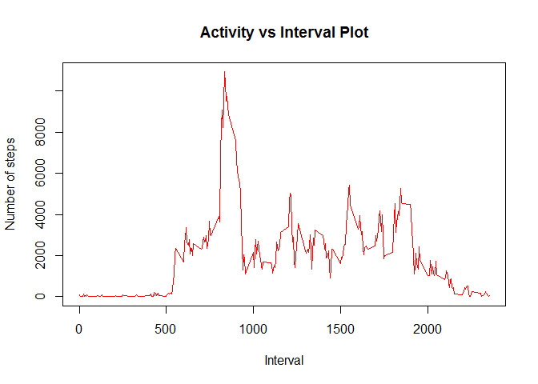
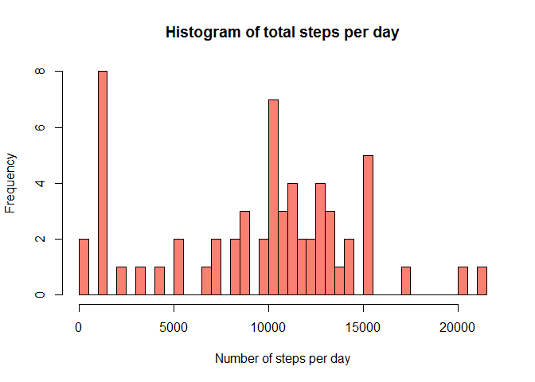
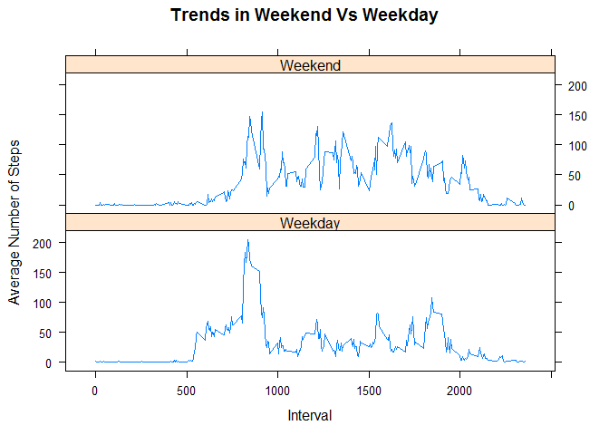

Loading and Preprocessing Data
------------------------------

The above mentioned data is loaded and preprocessed in the following
manner. Initially, NA's are omitted for easy calculations of the total
number of steps, mean and median.

    ## Reading data
    myData <- read.csv("../activity.csv")

    ## Load dplyr package
    library(dplyr)

    ## Omit rows with NAs
    reqData <- filter(myData,!is.na(steps))

Number of Steps per Day
-----------------------

Grouping the data per day and using summarise() to calculate the number
of steps taken per day. Since, the rows with NA are omitted, the total
for each day is a valid numeric value.

    ## Grouping data by day
    groupByDay <- group_by(reqData,date)

    ## Number of steps per day
    sumPerDay <- summarise(groupByDay,sum(steps, na.rm = TRUE))

    ## Print sumPerDay
    library(knitr)
    kable(sumPerDay, format = "markdown", col.names = c("Date", "Steps"))

<table>
<thead>
<tr class="header">
<th align="left">Date</th>
<th align="right">Steps</th>
</tr>
</thead>
<tbody>
<tr class="odd">
<td align="left">2012-10-02</td>
<td align="right">126</td>
</tr>
<tr class="even">
<td align="left">2012-10-03</td>
<td align="right">11352</td>
</tr>
<tr class="odd">
<td align="left">2012-10-04</td>
<td align="right">12116</td>
</tr>
<tr class="even">
<td align="left">2012-10-05</td>
<td align="right">13294</td>
</tr>
<tr class="odd">
<td align="left">2012-10-06</td>
<td align="right">15420</td>
</tr>
<tr class="even">
<td align="left">2012-10-07</td>
<td align="right">11015</td>
</tr>
<tr class="odd">
<td align="left">2012-10-09</td>
<td align="right">12811</td>
</tr>
<tr class="even">
<td align="left">2012-10-10</td>
<td align="right">9900</td>
</tr>
<tr class="odd">
<td align="left">2012-10-11</td>
<td align="right">10304</td>
</tr>
<tr class="even">
<td align="left">2012-10-12</td>
<td align="right">17382</td>
</tr>
<tr class="odd">
<td align="left">2012-10-13</td>
<td align="right">12426</td>
</tr>
<tr class="even">
<td align="left">2012-10-14</td>
<td align="right">15098</td>
</tr>
<tr class="odd">
<td align="left">2012-10-15</td>
<td align="right">10139</td>
</tr>
<tr class="even">
<td align="left">2012-10-16</td>
<td align="right">15084</td>
</tr>
<tr class="odd">
<td align="left">2012-10-17</td>
<td align="right">13452</td>
</tr>
<tr class="even">
<td align="left">2012-10-18</td>
<td align="right">10056</td>
</tr>
<tr class="odd">
<td align="left">2012-10-19</td>
<td align="right">11829</td>
</tr>
<tr class="even">
<td align="left">2012-10-20</td>
<td align="right">10395</td>
</tr>
<tr class="odd">
<td align="left">2012-10-21</td>
<td align="right">8821</td>
</tr>
<tr class="even">
<td align="left">2012-10-22</td>
<td align="right">13460</td>
</tr>
<tr class="odd">
<td align="left">2012-10-23</td>
<td align="right">8918</td>
</tr>
<tr class="even">
<td align="left">2012-10-24</td>
<td align="right">8355</td>
</tr>
<tr class="odd">
<td align="left">2012-10-25</td>
<td align="right">2492</td>
</tr>
<tr class="even">
<td align="left">2012-10-26</td>
<td align="right">6778</td>
</tr>
<tr class="odd">
<td align="left">2012-10-27</td>
<td align="right">10119</td>
</tr>
<tr class="even">
<td align="left">2012-10-28</td>
<td align="right">11458</td>
</tr>
<tr class="odd">
<td align="left">2012-10-29</td>
<td align="right">5018</td>
</tr>
<tr class="even">
<td align="left">2012-10-30</td>
<td align="right">9819</td>
</tr>
<tr class="odd">
<td align="left">2012-10-31</td>
<td align="right">15414</td>
</tr>
<tr class="even">
<td align="left">2012-11-02</td>
<td align="right">10600</td>
</tr>
<tr class="odd">
<td align="left">2012-11-03</td>
<td align="right">10571</td>
</tr>
<tr class="even">
<td align="left">2012-11-05</td>
<td align="right">10439</td>
</tr>
<tr class="odd">
<td align="left">2012-11-06</td>
<td align="right">8334</td>
</tr>
<tr class="even">
<td align="left">2012-11-07</td>
<td align="right">12883</td>
</tr>
<tr class="odd">
<td align="left">2012-11-08</td>
<td align="right">3219</td>
</tr>
<tr class="even">
<td align="left">2012-11-11</td>
<td align="right">12608</td>
</tr>
<tr class="odd">
<td align="left">2012-11-12</td>
<td align="right">10765</td>
</tr>
<tr class="even">
<td align="left">2012-11-13</td>
<td align="right">7336</td>
</tr>
<tr class="odd">
<td align="left">2012-11-15</td>
<td align="right">41</td>
</tr>
<tr class="even">
<td align="left">2012-11-16</td>
<td align="right">5441</td>
</tr>
<tr class="odd">
<td align="left">2012-11-17</td>
<td align="right">14339</td>
</tr>
<tr class="even">
<td align="left">2012-11-18</td>
<td align="right">15110</td>
</tr>
<tr class="odd">
<td align="left">2012-11-19</td>
<td align="right">8841</td>
</tr>
<tr class="even">
<td align="left">2012-11-20</td>
<td align="right">4472</td>
</tr>
<tr class="odd">
<td align="left">2012-11-21</td>
<td align="right">12787</td>
</tr>
<tr class="even">
<td align="left">2012-11-22</td>
<td align="right">20427</td>
</tr>
<tr class="odd">
<td align="left">2012-11-23</td>
<td align="right">21194</td>
</tr>
<tr class="even">
<td align="left">2012-11-24</td>
<td align="right">14478</td>
</tr>
<tr class="odd">
<td align="left">2012-11-25</td>
<td align="right">11834</td>
</tr>
<tr class="even">
<td align="left">2012-11-26</td>
<td align="right">11162</td>
</tr>
<tr class="odd">
<td align="left">2012-11-27</td>
<td align="right">13646</td>
</tr>
<tr class="even">
<td align="left">2012-11-28</td>
<td align="right">10183</td>
</tr>
<tr class="odd">
<td align="left">2012-11-29</td>
<td align="right">7047</td>
</tr>
</tbody>
</table>

Mean of the number of steps across all days.

    ## Mean of the total number of steps taken per day
    meanPerDay <- mean(sumPerDay$`sum(steps, na.rm = TRUE)`)
    meanPerDay

    ## [1] 10766.19

Median of the number of steps across all days.

    ## Median of the total number of steps taken per day
    medianPerDay <- median(sumPerDay$`sum(steps, na.rm = TRUE)`)
    medianPerDay

    ## [1] 10765

Plotting a histogram of the total number of steps taken each day.

    ## Histogram of the total number of steps taken per day
    hist(sumPerDay$`sum(steps, na.rm = TRUE)`, breaks = nrow(sumPerDay), xlab = "Number of steps per day", main = "Histogram of total steps per day", col = "salmon")

Average Daily Activity Pattern
------------------------------

This section groups activity data based on 5-minute intervals. The
following plot shows 5-minute interval (x-axis) and the average number
of steps taken, averaged across all days (y-axis)

    ## Grouping data by interval
    groupByInterval <- group_by(reqData,interval)

    ## Number of steps per interval across all days
    sumPerInterval <- summarise(groupByInterval,sum(steps, na.rm = TRUE))

    ## Plot of Activity vs Interval
    plot(x = sumPerInterval$interval, y = sumPerInterval$`sum(steps, na.rm = TRUE)`, xlab = "Interval", ylab = "Number of steps", main = "Activity vs Interval Plot", col = "red", type = "l")

The interval that contains the maximum number of steps on average across
all days.

    ## Find max interval with max steps
    orderedData <- arrange(sumPerInterval,desc(`sum(steps, na.rm = TRUE)`))
    orderedData$interval[1]

    ## [1] 835

Imputing Missing Values
-----------------------

Until this secion, rows with NAs were ignored. In this section NAs will
be imputed with median values. Specifically, median of the 5-minute
interval will be used.

Let's use the myData variable to calculate the number of NAs in the
data, since it is unprocessed.

    ## Generate boolean that gives information about NAs
    naOrNot <- is.na(myData$steps)
    sum(naOrNot)

    ## [1] 2304

Replacing the NAs as mentioned above.

    ## Find median across all intervals for all dates
    temp <- split(myData[,c(1.3)], myData$interval)
    temp2 <- sapply(temp, median, na.rm = TRUE)

    ## Combine median information with DataFrame
    imputedData <- cbind(myData, temp2)

    ## Impute NAs with median
    imputedData <- transform(imputedData, steps = ifelse(is.na(steps), temp2, steps))

Plotting a histogram of the total number of steps taken each day, with
NAs replaced.

    ## Grouping data by day
    groupByDay <- group_by(imputedData,date)

    ## Number of steps per day
    sumPerDay <- summarise(groupByDay,sum(steps))

    ## Histogram of the total number of steps taken per day
    hist(sumPerDay$`sum(steps)`, breaks = nrow(sumPerDay), xlab = "Number of steps per day", main = "Histogram of total steps per day", col = "salmon")

Mean of the number of steps across all days (with imputed data).

    ## Mean of the total number of steps taken per day
    meanPerDay <- mean(sumPerDay$`sum(steps)`)
    meanPerDay

    ## [1] 9503.869

Median of the number of steps across all days (with imputed data).

    ## Median of the total number of steps taken per day
    medianPerDay <- median(sumPerDay$`sum(steps)`)
    medianPerDay

    ## [1] 10395

As expected, after the data s imputed the mean and median values change.
Since a lot of the median values are small and even 0, the mean and
median have decreased now. This makes sense because alot of the newly
added values (ones that were NAs) are much smaller than the original
mean and median.

Weeday vs Weekend Trend
-----------------------

In the below code, a new factor variable, weekday, is initialized with 0
or 1. 1 stands for weekend and 0 for weekday. Also, the new vector is
combined the imputed data.

    ## A new vector that contains weekday info
    weekday <- factor(x=ifelse(weekdays(as.Date(imputedData$date))%in%c("Saturday", "Sunday"), 1, 0), labels = 
                        c("Weekday", "Weekend"))

    ## Combine with existing data
    imputedData <- cbind(imputedData, weekday)

    ## Group data by weekday and interval
    temp3 <- group_by(imputedData, weekday, interval)

    ## Obtain mean for the same groups
    temp4 <- summarise(temp3, mean(steps))

    ## Ploting the required graph

    library(lattice)

    temp5 <- aggregate(`mean(steps)` ~ weekday + interval, temp4, mean)
    xyplot(`mean(steps)` ~ interval | weekday, layout = c(1, 2), xlab="Interval", ylab="Average Number of Steps", type="l", data=temp5, main = "Trends in Weekend Vs Weekday")

As mentioned above, the weekday factor variable indicates whether the
given date is a weekend or not. Weekends are identified by 1. From the
above plot we see that the average trend observed in weekdays and
weekends are different. The highlighted portion around the curves show
the confidence interval.
